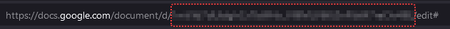
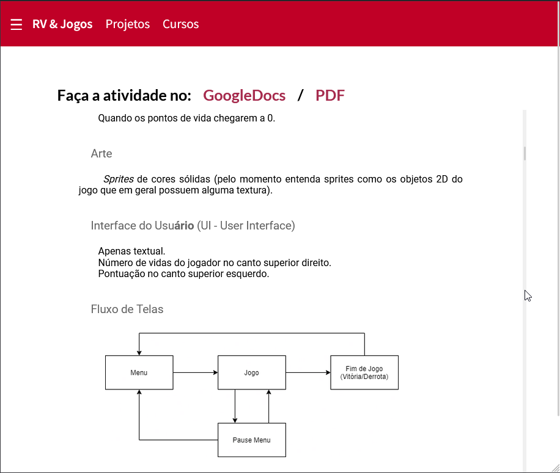
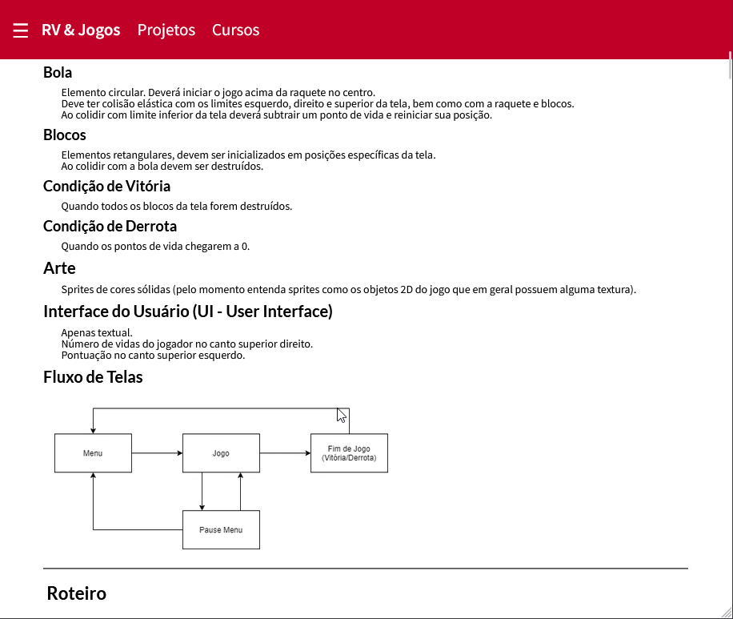

# Gdocs2jekyll

This is a simple Tags Plugin for [Jekyll](https://jekyllrb.com/) to include the
contents of a Google Docs file in a Jekyll page without the necessity to use the
 iframe required to embed the document. 

This plugin aims to maintain the use of the google docs for their features, like comments
ease to paste pictures and so on, as well as delivery a better experience for
the handouts included in a Jekyll managed website.


## Installation

Install the gem and add to the application's Gemfile by executing:

    $ bundle add gdocs2jekyll

If bundler is not being used to manage dependencies, install the gem by executing:

    $ gem install gdocs2jekyll

put this in your `_config.yml`

```
plugins: [gdocs2jekyll]
```

Finally, create a API Key in your Google Cloud Platform, with access to the Google Docs API, and set the `GOOGLE_DRIVE_API_KEY` environment variable 

```
export GOOGLE_DRIVE_API_KEY="your_generated_api_key"
```

Without this step, the tag won't generate any content.

## Usage

In your md file just use the tag 

```

```

The document ID can be found in the URL of your gdrive doc: 



### Comparison iframe embeded vs gdocs2jekyll jekyll tag

The ugly iframe solution with 2 scrolls and not so good awful responsiveness



gdocs2jekyll inserting the content "natively" in the page




## Development

After checking out the repo, run `bin/setup` to install dependencies. You can also run `bin/console` for an interactive prompt that will allow you to experiment.

To install this gem onto your local machine, run `bundle exec rake install`. To release a new version, update the version number in `version.rb`, and then run `bundle exec rake release`, which will create a git tag for the version, push git commits and the created tag, and push the `.gem` file to [rubygems.org](https://rubygems.org).

## Contributing

Bug reports and pull requests are welcome on GitHub at https://github.com/EmilFreme/gdocs2jekyll. This project is intended to be a safe, welcoming space for collaboration, and contributors are expected to adhere to the [code of conduct](https://github.com/EmilFreme/gdocs2jekyll/blob/master/CODE_OF_CONDUCT.md).

## License

The gem is available as open source under the terms of the [MIT License](https://opensource.org/licenses/MIT).

## Code of Conduct

Everyone interacting in the Gdocs2jekyll project's codebases, issue trackers, chat rooms and mailing lists is expected to follow the [code of conduct](https://github.com/EmilFreme/gdocs2jekyll/blob/master/CODE_OF_CONDUCT.md).
